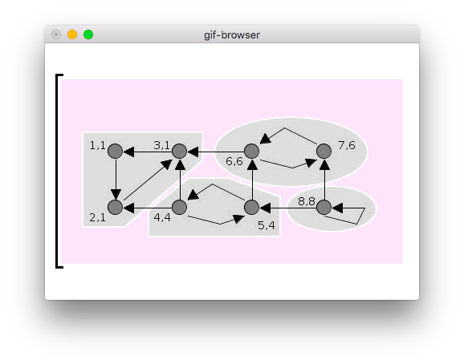

# gif-browser

```
usage:
  gif-browser GIF_FILE

Left/Right to navigate between frames,
Home/End to jump to the beginnin/end.
```



The pink region is meant to be keyed out (made transparent) by a screen capture application such as [OBS](https://obsproject.com/). Outside the captured region, the giant square brackets indicate whether this is the first and/or last image in the animation.

I wrote this small application live at https://twitch.com/gelisam, [here is the recording](https://youtu.be/xizwLjCHO1Y).

